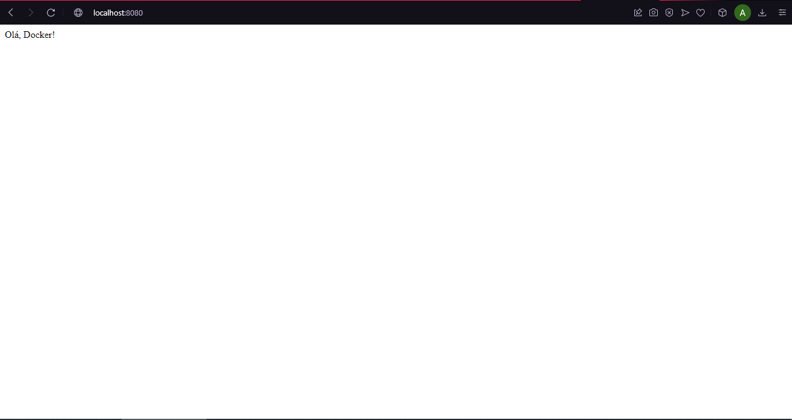

# Flask Docker Application

## Descrição
Este projeto é uma aplicação simples utilizando Flask que é contêinerizada usando Docker. A aplicação responde com uma mensagem "Olá, Docker!" quando acessada pela porta 8080.

## Pré-requisitos
- Docker instalado na máquina local.

## Etapas

### 1. Instalação do Docker
O Docker pode ser instalado a partir do site oficial: [Docker Desktop](https://www.docker.com/products/docker-desktop).

### 2. Criação da Aplicação Flask
Crie um diretório para o projeto e um arquivo `app.py` com o seguinte código:

```python
from flask import Flask

app = Flask(__name__)

@app.route('/')
def home():
    return "Olá, Docker!"

if __name__ == '__main__':
    app.run(host='0.0.0.0', port=8080)


